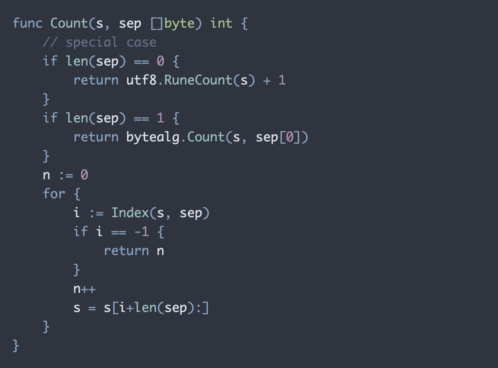

# Nord for Prism.js 

This is a personal implementation of the [Nord theme](https://www.nordtheme.com/)
for [PrismJS](https://prismjs.com/). 
All credit goes to the original author. 

The stylesheet is generated using 
http://k88hudson.github.io/syntax-highlighting-theme-generator/www 

## Quick Start

Download the `prism-nord.css` file in this repository.
Include the stylesheet in your page, as suggested in 
the [official documentation](https://prismjs.com/) 
of PrismJS.

```html
<!DOCTYPE html>
<html>
<head>
	<link href="themes/prism-nord.css" rel="stylesheet" />
</head>
<body>
	<script src="prism.js"></script>
</body>
</html>
```


## Demo

